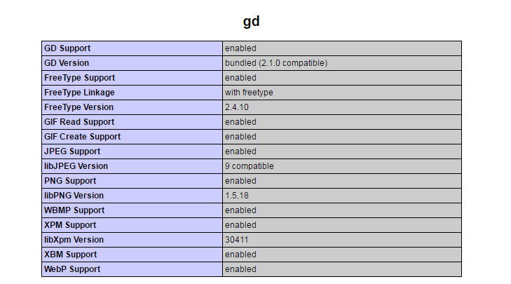
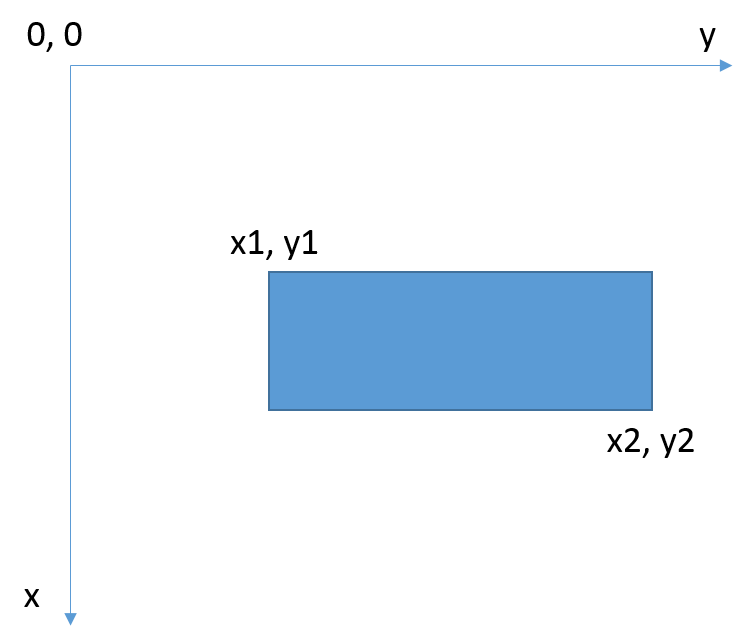

[Retour à l'accueil](README.md)

# M2202 | Séance 9 | Manipulation d'images

## Introduction

Dans ce TD/TP nous allons nous intéresser à la création et à la manipulation d’images avec PHP. Il peut parfois être intéressant de créer des images directement depuis votre site (un graphique par exemple), ou encore manipuler des images pour les redimensionner ou ajouter un copyright.

Tout cela PHP peut le faire nativement grâce à la librairie GD. Il existe également beaucoup d’autres librairies qui pourraient vous proposer des fonctionnalités plus "simples" ou plus "rapides".

Pour pouvoir manipuler les fichiers, vous devez vous assurer de mettre les droits en écriture et exécution sur votre répertoire. Il faut  ́egalement vérifier que la librairie GD est activée sur votre hébergement. Pour cela il suffit de faire un fichier php avec une commande phpinfo pour vérifier si GD est bien présent.
Vous trouverez toute la document sur la librairie GD sur le site de PHP.net : [http://php.net/manual/fr/book.image.php](http://php.net/manual/fr/book.image.php)

```php
 <?php
phpinfo();
?>
```

Si la librairie est activée vous devriez trouver un bloc ressemblant à celui ci-dessous :



## Une histoire de Header

Il y a deux façons de générer une image en PHP.

* Soit on fait en sorte que notre script PHP renvoie une image (au lieu d’une page web, comme on en avait l’habitude). Dans ce cas, si on va sur la page http://www.monsite.com/testgd.php, une image sera affichée et non pas une page web !
* Soit on demande à PHP d’enregistrer l’image dans un fichier.

Il va falloir envoyer ce qu’on appelle un header (un en-tête). Grâce à la fonction header, on va expliquer au navigateur que l’on est en train d’envoyer une image.

On peut choisir entre les types d’images suivants :
* JPEG : c’est un format très adapté pour les photos par exemple, car on peut utiliser beaucoup de couleurs;
* PNG : c’est le format le plus récent, très adapté dans la plupart des cas. 

Le code ci-dessous est un exemple de header permettant de renvoyer au navigateur une image PNG.

```php
<?php
header ("Content-type: image/png"); ?>
```

**ATTENTION : Il ne doit jamais avoir un texte, un espace, un echo, ... avant le header !** (comme pour les sessions)

Ensuite, on peut créer une image vide avec le code ci-dessous.

```php
<?php
header ("Content-type: image/png"); $image = imagecreate(200,50);
?>
```

`$image` ne contient ni un nombre, ni du texte. Cette variable contient une "image". On dit que `$image` est une **"ressource"**. Une ressource est une variable un peu spéciale qui contient toutes les informations sur un objet. Ici, il s’agit d’une image, mais il pourrait très bien s’agir d’un PDF ou même d’un fichier que vous avez ouvert avec fopen...

## Se repérer dans une image

Le positionnement dans une image fonctionne en pixel. L’identification d’un point se fait selon ses coordonnées x et y, notées (x, y). Le point (0, 0) se trouve en haut à gauche. Le schéma ci dessous vous montre comment repérer un rectangle.



## Exercices

### Exercice 1

Tester le code ci-dessous. Recopier ce code dans un fichier appelé *genere_image.php*. Il vous faudra récupèrer un fichier ttf (une police de caractère) de votre choix, et le déposer au même endroit que le fichier *genere_image.php*. N’oubliez pas d’adapter le nom de la police dans le code ci-dessous.

```php
<?php
header ("Content-type: image/png");
$im = imagecreate(640, 480);
$fond = imagecolorallocate($im, 200, 200, 200);
$couleur = imagecolorallocate($im, 0, 0, 255);
$noir = imagecolorallocate($im, 0, 0, 0);
$blanc = imagecolorallocate($im, 255, 255, 255);
imagefill($im, 0, 0, $fond);
Imagefilledrectangle($im, 100, 200, 300, 400, $couleur); // Ecrire des textes avec GD
$font = './arial.ttf'; $texte = 'Bonjour !';
imagettftext($im, 148, 0, 200, 100, $blanc, $font, $texte  → );
imagepng($im); imagedestroy($im); 
?>
```

Vous devez également mettre les droits en écriture et exécution sur le répertoire qui contient l’ensemble de ces fichiers.

### Quelques explications

```php
 <?php
Imagefilledrectangle($im, 100, 200, 300, 400, $couleur);
```

Cette fonction permet de créer un rectangle avec les paramètres suivants :

1. L’image
2. La coordonnées x du premier point (normalement le point en haut, à gauche, cf. image ci-dessus)
3. La coordonnées y du premier point (normalement le point en haut, à gauche, cf. image ci-dessus)
4. La coordonnées x du deuxième point (normalement le point en bas, à droite, cf. image ci-dessus)
5. La coordonnées y du deuxième point (normalement le point en bas, à droite, cf. image ci-dessus)
6. La couleur de remplissage

```php
 <?php
imagettftext($im, 148, 0, 200, 100, $blanc, $font, $texte);
```

Cette fonction permet d'inscrire du texte dans une image, avec les paramètres suivants :

1. L’image
2. La taille de la police
3. L’orientation de la police (un angle) 
4. La position x
5. La position y
6. La couleur du texte
7. La police utilisée
8. Le texte

Lancer ce fichier dans votre navigateur est regardé le résultat. Ce résultat est-il correct ?

### Exercice 2 : A vous de jouer

* Créer une image de taille 800x600 pixels, avec un fond noir
* Ajouter 100 rectangles de taille et de couleur prise au hasard (utiliser la fonction rand(mini,maxi) qui tire un nombre au hasard entre mini et maxi.
* Ajouter un texte au milieu de l’image (attention, il faut qu’il soit lisible !)
* Créez ensuite un fichier php qui va contenir par exemple le code ci-dessous: 

*Toutes les instructions existent pour des images JPEG.*

```php
<!DOCTYPE html>
<html lang="fr">
<head><meta charset="utf-8" /></head>
<body style="font-family: sans-serif;">
<?php
echo ''; ?>
</body>
</html>
```

Regardez le résultat.

## Manipulation d’une image

Nous avons précédemment créé une image à partir de rien. Cette méthode est intéressante pour par exemple obtenir un graphique. Cependant, il peut aussi être intéressant de modifier une image existante. Pour cela on utilise l’instruction suivante :

```php
<?php
header("Content-type: image/jpeg");
$image = imagecreatefromjpeg("monimage.jpg"); 
?>
```

Cette instruction permet de créer une resource image à partir d'une image existante. On peut ensuite la manipuler comme vu précédemment.

## Exercice

* En vous aidant des exemples précédents, écrire sur l’image un texte.
* En utilisant la documentation, récupérez la taille de l’image et essayez d’écrire un copyright en bas à droite de votre image. 
* Testez avec une autre image pour vous assurer que le copyright reste au bon endroit.
* Ecrire un formulaire qui permette l’upload d’une image (Semestre 1), et ajoute automatiquement le copyright. Afficher l’image modifiée.
