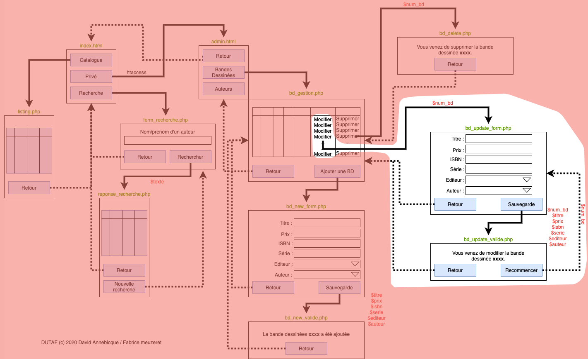
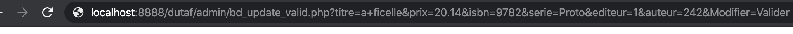

# M2203 \| Séance 13 \(TP\) \| Validation du formulaire de modification \(3 avril\)



presentation rapide:




le fichier "BD\_update\_valide.php" doit comporter une requete de type UPDATE pour mettre à jour les champs modifiés dans le formulaire précédent.

```text
...
<h2>Vous venez de modifier un album...</h2>
<hr>
<?php 
$bdd = new PDO(...);

$titre = $_GET['titre'];
$prix = $_GET['prix'];
...

$requete = 'UPDATE ... SET ... WHERE ...';

$bdd->query($requete);

?>
...
```

la question ici c'est: que mettre après le WHERE?   il faut faire un UPDATE uniquement pour l'article qui a été modifié dans le formulaire, donc quelque chose comme:  ....WHERE album\_id=$id ...   mais dans ce cas il faut récupérer $id comme on récupère le prix ou le titre dans l'URL \($\_GET\)

il faudrait donc quelque chose comme:

```text
...
<h2>Vous venez de modifier un album...</h2>
<hr>
<?php 
$bdd = new PDO(...);

$titre = $_GET['titre'];
$prix = $_GET['prix'];
...
$id = $_GET['id'];

$requete = 'UPDATE ... SET ... WHERE album_id='.$id ;

$bdd->query($requete);

?>
...
```

 le soucis, c'est que l'id de l'article n'est pas envoyé dans l'url par le formulaire:



Il faut donc modifier le fichier bd\_update\_form.php pour qu'il envois l'id au même titre que le titre ou le prix:

```text
...
id<input type="text" name="id" value="<?php  echo $album['album_id']  ?>"><br>
titre<input type="text" name="titre" value="<?php  echo $album['album_titre']  ?>"><br>
prix<input type="text" name="prix" value="<?php  echo $album['album_prix']  ?>"><br>
...
```

le soucis maintenant c'est que l'id de l'album apparait dans le formulaire comme un champ modifiable par l'utilisateur. Ce qui n'est pas très sécure car l'utilisateur peut le modifier et mettre un autre id \(peut etre déjà utilisé d'ailleurs\). Il faut donc mieux masquer ce champs pour ne pas que l'utilisateur le modifie par erreur.

```text
...
<input type="hidden" name="id" value="<?php  echo $album['album_id']  ?>">
titre<input type="text" name="titre" value="<?php  echo $album['album_titre']  ?>"><br>
prix<input type="text" name="prix" value="<?php  echo $album['album_prix']  ?>"><br>
...
```

Voilà, l'ensemble doit permettre de modifier n'importe quel album.  Il faut bien sur vérifier que cela fonctionne et que les modifications sont effectivement faites.

#### aide au debuguage: 

 si tout semble marcher sans message d'erreur mais qu'aucune modification fonctionne, et bien mettez un echo de la requete dans bd\_valid\_modif.php

```text
...
<h2>Vous venez de modifier un album...</h2>
<hr>
<?php 
$bdd = new PDO(...);

$titre = $_GET['titre'];
$prix = $_GET['prix'];
...
$id = $_GET['id'];

$requete = 'UPDATE ... SET ... WHERE album_id='.$id ;

echo "<br>pour debug: " . $requete ."<br>";

$bdd->query($requete);

?>
...
```

ensuite testez la modification et regardez dans le navigateur l'affichage de la requete, copiez là et collez là dans phpmyadmin pour voir si mysql vous renvois une erreur,  tant que la requete ne marche pas dans phpmyadmin, elle  marchera encore moins dans votre page php!... bon débug à vous.

### video d'explication de tous ces points:




