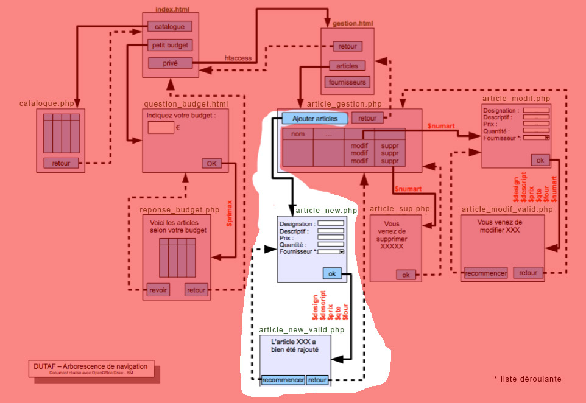

# M2203-seance-10

## M2203 \| Séance 10 \(TP\) \| Ajout d’un article \(form\_new\_art.php et valid\_new\_art.php\)

 Mettre en oeuvre le formulaire article\_new.php et la page article\_new\_valid.php en les créant dans le sous-dossier "admin"

dans le fichier article\_new.php, bien nommer les différents champs du formulaire comme sur le document ci-dessus.

Passer les champs en GET \( &lt;form... method='GET' ...\)

Vérifier que quand vous valider le formulaire en cliquant sur le bouton que les parametres passent dans l'URL.

Réaliser une liste déroulante pour choissir le fournisseur plutot que de saisir son code.

```text
<select name="four">
<?php 
$maconnexion = ... PDO ...
$req2='SELECT * FROM fournisseurs';
$resultat2 = $maconnexion->query($req2);

while( $un_four = $resultat2->fe.....() ) {
 echo '<option value="'.$un_four['...._id'].'">'.$un_four['...._nom'].'</option>';
 }
?>
</select>
```

dans le fichier article\_new\_valid.php récupérer les champs du formulaire \(... $designation= $\_GET\['design'\] ...\)

dans le fichier article\_new-valid.php, préparer la requete SQL nécessaire pour ajouter un article \(tester votre requete dans phpMyAdmin avant de la tester dans le fichier php.

```text
<html>
...
<?php 
$maconnexion = ... PDO ...
$req='INSERT INTO .... VALUES(... $designation ... $prix ...)';
$maconnexion->query($req);
?>
vous venez d'ajouter un article (sans vérification:-) )
...
</html>
```

