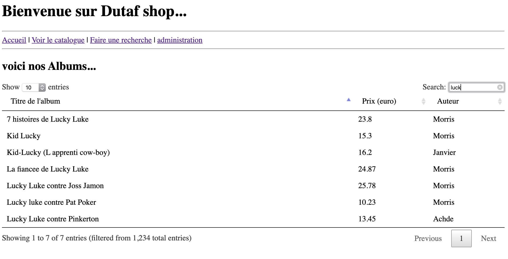
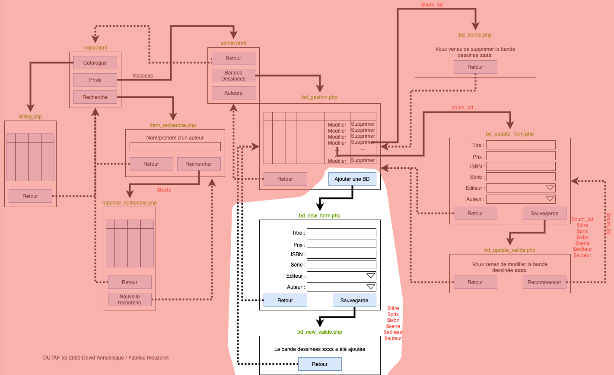

# M2203 \| Séance 10 \| Ajout d’une BD \(bd\_new\_form.php et bd\_new\_valide.php\)

## partie préliminaire:   améliorer le look et l'ergonomie de la page listing \(idem reponse\_recherche.php et bd\_gestion.php\)



dans ce screenshot, nous voyons une mise en forme du tableau des albums efficace avec des tris, une recherche et de la pagination.

video d'explication sur cette mise en forme automatique: [https://youtu.be/EnSk9w8fWGw](https://youtu.be/EnSk9w8fWGw)

## gestion de l'ajout:



presentation de l'ajout: [https://youtu.be/G6yImHeTCGo](https://youtu.be/G6yImHeTCGo)

## Mettre en oeuvre le formulaire bd\_new\_form.php et la page bd\_new\_valide.php en les créant dans le sous-dossier "admin"

dans le fichier bd\_new\_form.php, bien nommer les différents champs du formulaire comme sur le document ci-dessus.

Passer les champs en GET \( &lt;form... method='GET' ...\)

Vérifier que quand vous valider le formulaire en cliquant sur le bouton que les paramètres passent dans l'URL.

Réaliser une liste déroulante pour choisir le fournisseur plutôt que de saisir son code.

```php
<select name="editeur">
<?php 
$maconnexion = ... PDO ...
$req2='SELECT * FROM editeur';
$resultat2 = $maconnexion->query($req2);

while( $un_editeur = $resultat2->fe.....() ) {
 echo '<option value="'.$un_editeur['...._id'].'">'.$un_editeur['...._nom'].'</option>';
 }
?>
</select>
```

dans le fichier bd\_new\_valide.php récupérer les champs du formulaire \(... $titre= $\_GET\['titre'\] ...\)

dans le fichier bd\_new\_valide.php, préparer la requête SQL nécessaire pour ajouter un album \(tester votre requete dans phpMyAdmin avant de la tester dans le fichier php.

INSERT INTO albums VALUE\( NULL, 'titre de mon album', '44646BD' ...\);   

n'essayez pas de taper du php tant que vous n'arrivez pas à faire une requete SQL qui fonctionne dans phpmyadmin \(cela ne servira à rien\)

```php
<html>
...
<?php 
$maconnexion = ... PDO ...
$req='INSERT INTO .... VALUES(... $titre ... $prix ...)';
$maconnexion->query($req);
?>
vous venez d'ajouter une bande dessinnée (sans vérification:-) )
...
</html>
```

