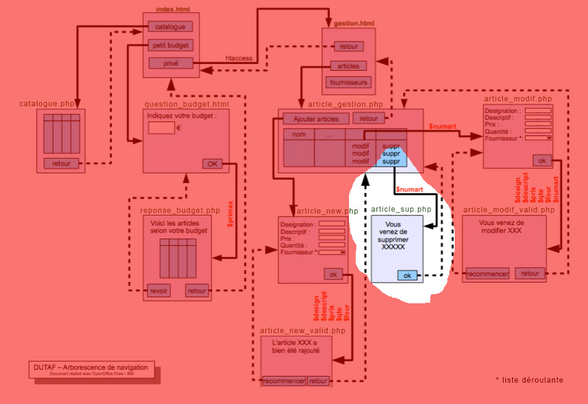

# M2203-seance-11

## M2203 \| Séance 11  \| Suppression d’un article

[Retour à l'accueil](./)

 Mettre en oeuvre la page article\_sup.php en la créant dans le sous-dossier "admin"

Passer le champs numart en GET depuis la page article\_gestion.php \( ... article\_sup.php?numart= ...\)

Vérifier que quand vous cliquer sur "supprimer" \(dans la page article\_gestion.php\) que le numero de l'article passent dans l'URL.

dans le fichier article\_sup.php, préparer la requete SQL nécessaire pour supprimer l'article passé dans l'url.

