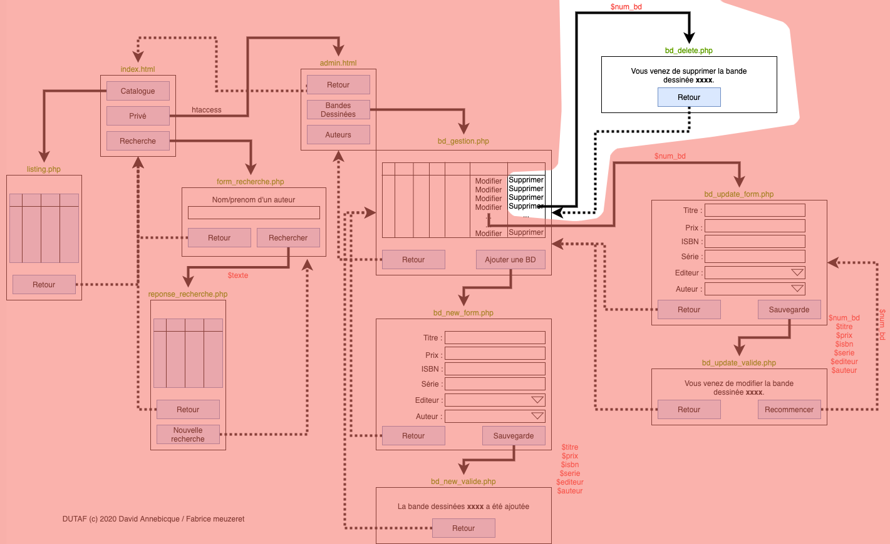

# M2203 \| Séance 11  \| Suppression d’un article \(24 mars\)

correction seance précédente \(ajout\): [https://youtu.be/IhuPkWgPx\_g](https://youtu.be/IhuPkWgPx_g)

## Mettre en oeuvre la page bd\_delete.php en la créant dans le sous-dossier "admin"

Passer le champs `num_bd` en GET depuis la page bd\_gestion.php \( ... bd\_delete.php?num\_bd= ...\)

video explicative sur la gestion du lien "supprimer": [https://youtu.be/TU6\_vhCpOUE](https://youtu.be/TU6_vhCpOUE)

Vérifier que quand vous cliquer sur "supprimer" \(dans la page bd\_gestion.php\) que le numero de la bande dessinée passent dans l'URL.

dans le fichier bd\_delete.php, préparer la requete SQL nécessaire pour supprimer l'article passé dans l'url.

video explicative sur le fichier bd\_delete.php: [https://youtu.be/NDAc1g2tW1c](https://youtu.be/NDAc1g2tW1c)

