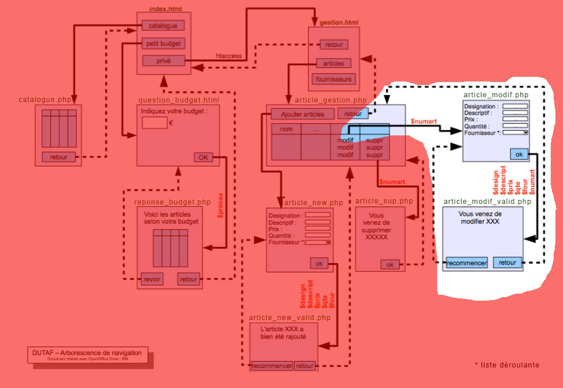

# M2203-seance-12

## M2203 \| Séance 12 \(TP\) \| Finalisation DUTAF

 Mettre en oeuvre la page article\_modif\_valid.php et article\_modif.php en les créant dans le sous-dossier "admin"

Passer le champs numart en GET depuis la page article\_gestion.php \( ... article\_modif.php?numart= ...\)

...

