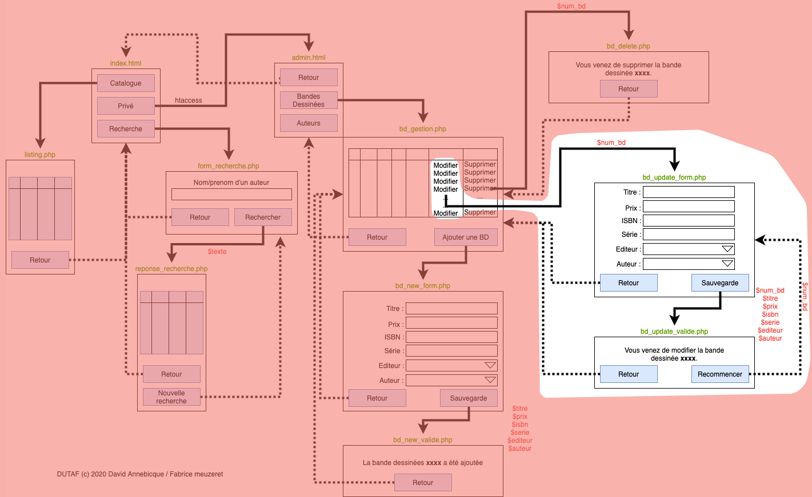

# M2203 \| Séance 12 \(TP\) \| Finalisation DUTAF

## Mettre en oeuvre la page bd\_update\_form.php et bd\_update\_valide.php en les créant dans le sous-dossier "admin"

Passer le champs numart en GET depuis la page article\_gestion.php \( ... bd\_update\_form.php?num\_bd= ...\)

...

