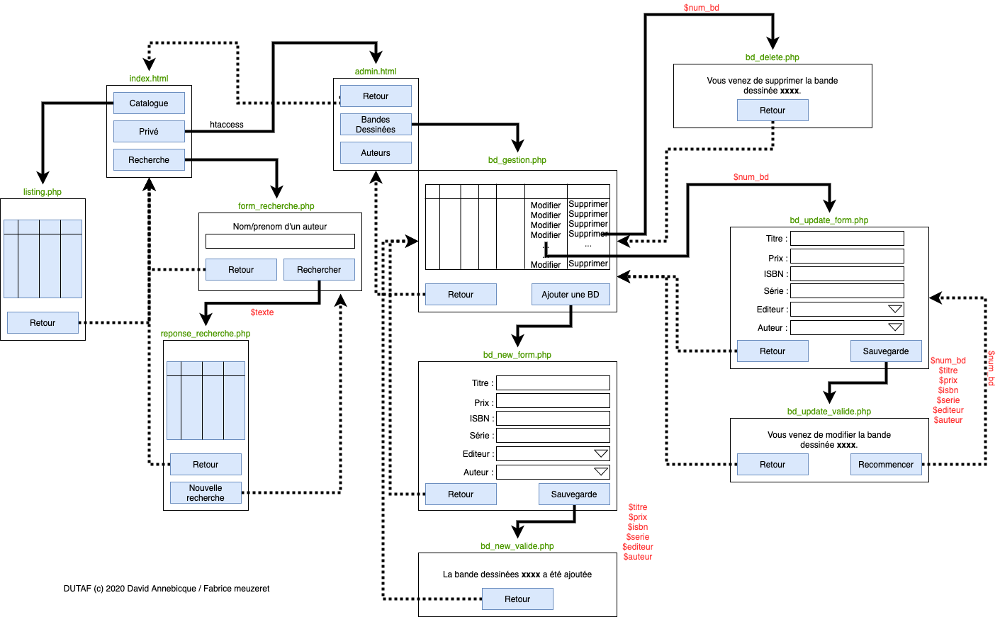

# M2203 \| CM \| Analyse DUTAF et Mise en place de la Bd

## Objectifs

Mettre en œuvre une Solution PHP/MySQL pour répondre à un problème de gestion de base de données.

## Document

support du cours \[cm2.pdf\].

## Présentation de la société DUTAF



## Premier exercice : analyse SGBDR

1. Après avoir répertorié les données du problème, proposez le dictionnaire des données.
2. Après avoir fait l'analyse des dépendances fonctionnelles, construisez le MCD.
3. Ecrire le MLD.

## Deuxième exercice : mise en œuvre de la base de données sous mySQL

1. En vous basant sur l'analyse, créez les tables dans PhpMyAdmin.
2. Récupérez le fichier [dutaf.xls](https://github.com/Dannebicque/dutafguide/tree/fbeb4cdebb2ab1a9902dc9e3b2f9761508d8dcd0/dutaf.xls) contenant les données nécessaires au TD pour les importer dans les

   tables. \(attention, n'utilisez pas l'importation automatique ! Passez par des fichiers CSV\)

### complément:

Tester les requêtes suivantes: 

1. Afficher la liste des articles \(titre, collection, prix de vente\) par ordre décroissant du prix
2. Afficher la liste des bandes dessinées de moins de 11 Euros. 
3. Afficher la liste complète des bandes dessinées avec à chaque fois l'éditeur.
4. Afficher la liste complète des bandes dessinées avec à chaque fois l'éditeur et le nom et prénom de l'auteur.
5. Augmenter tous les prix de vente de 4%. 
6. Retrouver les prix d’origine.
7. Afficher le titre et le prix de l’article le moins cher. 
8. Afficher le titre et le prix de l'article le plus cher. 
9. De la même façon, afficher le prix moyen des bandes dessinées. 
10. Afficher le prix moyen des bandes dessinées pour chacun des éditeurs. 
11. Compter les bandes dessinées pour chacun des éditeurs

## Troisième exercice : analyse fonctionnelle et mise en place du site

Analysez le cahier des charges des fonctions demandées \(visu catalogue, formulaire...\) et retrouver ces fonctionnalités dans l'arborescence proposée. Développer l'ensemble des pages en mode statique \(mettre quelques exemples sur la page catalogue\) analyser l'ensemble des fonctionnalités nécessaires et leur structuration au sein du site.

## Création de l'infrastructure

Développer l'ensemble des pages en mode statique \(mettre quelques exemples sur la page catalogue\).


La partie gestion des éditeurs n'est pas à faire. La partie gestion des auteurs sera à réaliser suivant le même principe \(ajouter, modifier, supprimer\)


