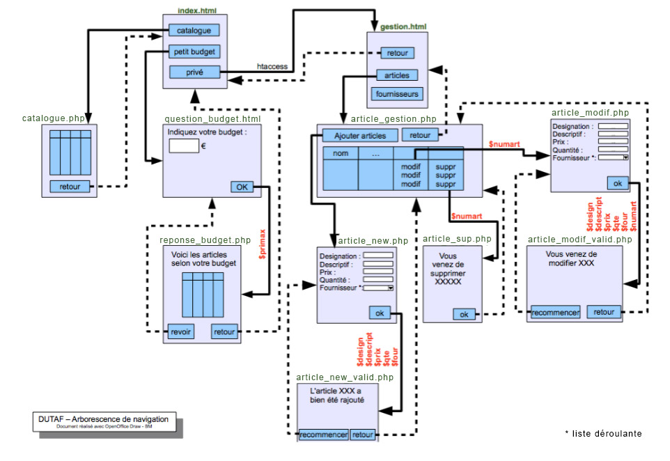

# M2203-seance-5

[Retour à l'accueil](./)

## M2203 \| CM \| Analyse DUTAF et Mise en place de la Bd

### Objectifs

Mettre en œuvre une Solution PHP/MySQL pour répondre à un problème de gestion de base de données.

### Document

support du cours \[cm2.pdf\].

### Exposé du sujet :

* La société Dutaf, qui est une librairie en ligne, vous demande de créer son site Internet sur lequel ses clients pourront consulter le catalogue complet. Cette société appartient à M. Levetar. Son catalogue est composé de plus de 1000 bandes dessinées.
* II désire pouvoir faire la mise à jour de ses produits lui-même \(changer un prix, ajouter une bande dessinées, effacer une bande dessinées\) sans avoir à faire appel à vos services. Pour cela, il vous demande de développer le site de telle manière qu’il y ait une section qui lui sera réservée et dans laquelle il pourra, via Internet et des pages web, venir faire ses modifications.
* Une bande dessinées est identifiée par un numéro dans le catalogue \(ISBN\), un titre, éventuellement une série, un prix de vente, un numéro d'éditeur et un identifiant d'auteur.
* Un éditeur est qualifié par un numéro et un nom. Une bande dessinée n'est fournie que par un seul éditeur.
* Un auteur est défini par son nom, prénom, une nationalité et une photo. Une bande dessinée n'est écrite que par un seul auteur.
* II existe une vingtaine d'éditeurs. Cette liste est fixe et ne demande pas a être modifiable par M. Levetar.
* Sur le même principe que les bandes dessinées, M. Levetar désire pouvoir faire ses propres changements dans la liste des auteurs.
* M. Levetar se sert déjà un peu d’internet mais il ne connaît aucun logiciel de mise en page web et ne compte pas s'investir dans la création de page web. II ne connaît d'ailleurs pas plus les notons de base de données.
* II désire aussi qu’un client puisse demander uniquement la liste des bandes dessinées  correspondant à un auteur en particulier. Pour cela, il devra y avoir une section dans laquelle le client pourra entrer quelques lettres du nom ou du prénom de l'auteur et par la suite consulter uniquement les bandes dessinées correspondantes à sa requête.

### Premier exercice : analyse SGBDR

1. Après avoir répertorié les données du problème, proposez le dictionnaire des données.
2. Après avoir fait l'analyse des dépendances fonctionnelles, construisez le MCD.
3. Ecrire le MLD.

### Deuxième exercice : mise en œuvre de la base de données sous mySQL

1. En vous basant sur l'analyse, créez les tables dans PhpMyAdmin.
2. Récupérez le fichier [dutaf.xls](https://github.com/Dannebicque/dutafguide/tree/fbeb4cdebb2ab1a9902dc9e3b2f9761508d8dcd0/dutaf.xls) contenant les données nécessaires au TD pour les importer dans les

   tables. \(attention, n'utilisez pas l'importation automatique ! Passez par des fichiers CSV\)

### complément:

Tester les requêtes suivantes: 

1. Afficher la liste des articles \(titre, collection, prix de vente\) par ordre décroissant du prix
2. Afficher la liste des bandes dessinées de moins de 11 Euros. 
3. Afficher la liste complète des bandes dessinées avec à chaque fois l'éditeur.
4. Afficher la liste complète des bandes dessinées avec à chaque fois l'éditeur et le nom et prénom de l'auteur.
5. Augmenter tous les prix de vente de 4%. 
6. Retrouver les prix d’origine.
7. Afficher le titre et le prix de l’article le moins cher. 
8. Afficher le titre et le prix de l'article le plus cher. 
9. De la même façon, afficher le prix moyen des bandes dessinées. 
10. Afficher le prix moyen des bandes dessinées pour chacun des éditeurs. 
11. Compter les bandes dessinées pour chacun des éditeurs

### Troisième exercice : analyse fonctionnelle et mise en place du site

Analysez le cahier des charges des fonctions demandées \(visu catalogue, formulaire...\) et retrouver ces fonctionnalités dans l'arborescence proposée. Développer l'ensemble des pages en mode statique \(mettre quelques exemples sur la page catalogue\) analyser l'ensemble des fonctionnalités nécessaires et leur structuration au sein du site. 

### creation de l'infrastructure

développer l'ensemble des pages en mode statique \(mettre quelques exemples sur la page catalogue\)

