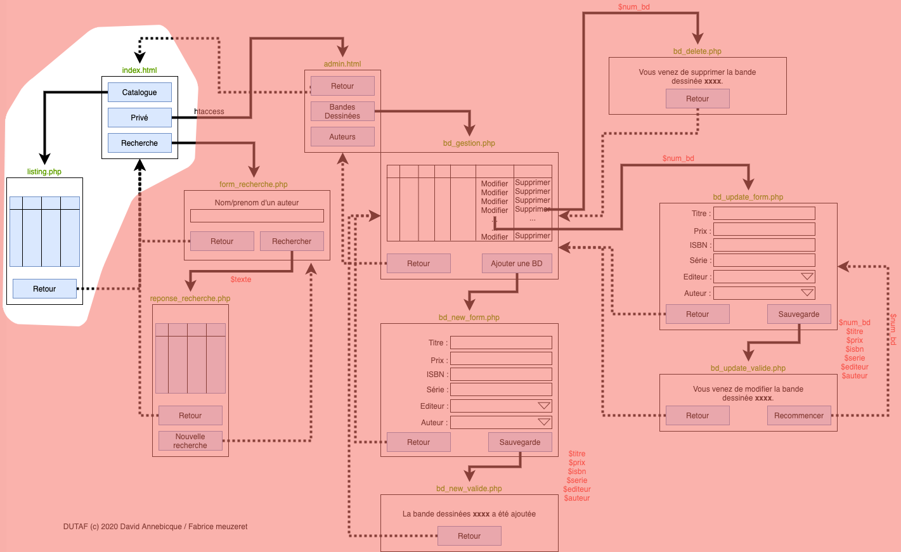

# M2203 \| Séance 7 \| Listing



## Développement de la page d'accueil

Après avoir pris connaissance de l'arbre de navigation, développez la page d'accueil \(index.html\)

## Développement de la page listing.php.

Pour la page listing.php, l'objectif est d'afficher toutes les BD de la base de données avec l'auteur et l'éditeur associé. Les éléments ci-après, vous permettent de vous connecter à une base de données, d'exécuter une requête simple et d'afficher les résultats retournés.

### Se connecter à une base de données

Pour pouvoir se connecter à une base de données, quelque soit la méthode utilisée, vous devez disposer des 4 informations suivantes :

* User : Login de votre base de données \(_mmi17xxx_\)
* Password : Mot de passe pour accéder à votre base de données
* Serveur : Adresse où se trouve votre base de données \(localhost en général\)
* Nom de la base de données : Le nom de la base de données. \(_mmi17xxx_ en MMI\)

Dans la configuration de votre VPS initiale, les accès à votre base de données par défaut, sont les mêmes que ceux de votre FTP. En cas de problème, vous pouvez vous connecter en SSH et créer une nouvelle base de données associé à un nouvel utilisateur.

Le serveur permet de donner l’adresse de votre base de données, très souvent, la base de données étant sur le même serveur que votre serveur web, on indique _"localhost"_. Dans certain cas, on pourra indiquer une URL ou une adresse IP.

Le code ci-dessous correspond à la phrase de connexion à une base de données de type MySQL. Cette instruction comprend 3 éléments. La _phrase de connexion_ `mysql:host=serveur;dbname=nom_de_la_BDD;charset=utf8` \(propre à chaque système de base de données\), un _login_ et un _mot de passe_.

```php
<?php
$bdd = new PDO('mysql:host=serveur;dbname=nom_de_la_BDD;
charset=utf8', 'User', 'Password');
```

Il faut bien sûr remplacer dans l’instruction précédente le "serveur", le "nom de la BDD", le "User" et le "Password" par vos informations personnelles. _Il est important de ne mettre aucun espace dans la phrase de connexion._

### PHP: Définition de constantes

La connexion à la base de données est potentiellement nécessaire sur beaucoup de fichiers de notre projet. En effet, il faut effectuer la connexion sur chaque nouvelle page où cela est nécessaire. La connexion n’est pas permanente.

Il faudra donc écrire l’instruction ci-dessus autant de fois que nécessaire, et en cas de changement de base de données, il faudra modifier chacune des connexions avec les nouveaux paramètres. Ce qui va à l’encontre de la logique de programmation et de non duplication des éléments.

Une solution consiste donc à définir des constantes PHP. Une constante est une variable particulière qui ne peut pas varier pendant l’exécution du script PHP. L’intérêt va donc être de définir une constante pour chacun des quatre paramètres et ensuite utiliser cette constante quand cela sera nécessaire. De cette manière, il n’y aura qu’un seul endroit ou modifier les informations.

La syntaxe est la suivante :

```php
<?php
define('NOM_CONSTANTE', 'valeur');
...
```

L’usage veut que le nom d’une constante soit en majuscule. **A noter qu’une constante ne commence pas par un $**.

Dans notre cas, un fichier type de constante pourrait être :


```php
<?php
define('BDD_LOGIN', 'monlogin');
define('BDD_PASSWORD', 'monpassword');
define('BDD_SERVER', 'localhost');
define('BDD_DATABASE', 'basededonnees');
?>
```


Ces éléments sont sauvegardés dans un fichier que l’on peut appeler _"config.inc.php"_. Ce fichier contiendra toutes nos constantes. Il faut ensuite **inclure** ce fichier à chaque fois que l’on va faire une connexion à notre base de données.

Ce qui pourrait donner le code suivant :

```php
...
<?php
include('config.inc.php');

$bdd = new PDO('mysql:host='.BDD_SERVER.';dbname='.BDD_DATABASE.';charset=utf8', BDD_LOGIN, BDD_PASSWORD);
```

### Récupérer des données

#### Exécuter une requête

Le code ci-dessous va permettre d'écrire une requête en MySQL et de l'éxécuter afin d'intéragir avec le serveur de base de données.

```php
...
<?php
include('config.inc.php');

$bdd = new PDO('mysql:host='.BDD_SERVER.';dbname='.BDD_DATABASE.';charset=utf8', BDD_LOGIN, BDD_PASSWORD);

$requete = 'SELECT * FROM table';
$exe = $bdd->query($requete);
```

Explication des lignes :

* ligne 5 : C'est cette ligne qui permet la connexion à la base de données.
* ligne 7 : Cette ligne permet d’écrire la requête au format MySQL. Une requête est avant tout du texte ! Il est donc possible de construire cette phrase en concaténant des variables.
* ligne 8 : Cette ligne exécute la requête précédemment écrite. C’est à ce moment là que le résultat de la requête est récupéré dans la variable $exe.

Il n’est techniquement pas nécessaire de passer par une variable intermédiaire pour écrire la requête SQL \(la variable `$requete`\). **Cependant vous utiliserez TOUJOURS cette solution durant ce semestre**. Il sera ainsi beaucoup plus facile de débuguer et comprendre ce qui se passe en affichant, dans le navigateur, la requête.

### Afficher le résultat d’une requête

La variable $exe contient donc le résultat de notre requête.

Ce résultat, si la requête a réussi, est un tableau composé des lignes de la base de données correspondant à la selection. Il faut donc parcourir ce tableau afin d’afficher chacune des lignes. Il y a deux méthodes pour réaliser cela :

* Compter le nombre total d’élément dans le tableau, et faire une boucle "for"
* Parcourir le tableau jusqu’à ce qu’il n’y ait plus d’éléments.

#### **Parcourir avec une boucle for**

```php
<?php
include('config.inc.php');

$bdd = new PDO('mysql:host='.BDD_SERVER.';dbname='.BDD_DATABASE.';charset=utf8', BDD_LOGIN, BDD_PASSWORD);

$requete = 'SELECT * FROM table';
$exe = $bdd->query($requete);

$nbreponses = $exe->rowCount();

for($i=0; $i<$nbreponses; $i++)
{
    $ligne = $exe->fetch();
    echo '<p>'.$ligne['champ1'].' '.$ligne['champ2'].'</p>';
}
```

Explication des lignes

* ligne 6 : Ecriture de notre requête dans une variable
* ligne 7 : Exécution de la requête pour récupérer les réponses
* ligne 9 : Comptage du nombre de réponse de la requête. On pourrait utiliser cette variable pour afficher le nombre de réponse à l’utilisateur.
* ligne 10 : Déclaration d’une boucle for qui va permettre de parcourir toutes les réponses
* ligne 13 : Cette ligne permet de récupérer une ligne parmi l’ensemble des lignes du tableau. "fetch" signifiant "va chercher". A chaque itération de la boucle, on va chercher la ligne suivante dans le tableau des réponses. La notation "-&gt;" est une notation objet. Vous la comprendrez mieux lors du prochain semestre.
* ligne 14 : On affiche les données. A noter que la variable $ligne est un tableau associatif dont la clé est le nom du champ de votre table.

#### **Parcourir avec une boucle while**

```php
<?php
include('config.inc.php');

$bdd = new PDO('mysql:host='.BDD_SERVER.';dbname='.BDD_DATABASE.';charset=utf8', BDD_LOGIN, BDD_PASSWORD);

$requete = 'SELECT * FROM table';
$exe = $bdd->query($requete);

while($ligne = $exe->fetch())
{
    echo '<p>'.$ligne['champ1'].' '.$ligne['champ2'].'</p>';
}
```

Explication des lignes :

* ligne 6 : Ecriture de notre requête dans une variable
* ligne 7 : Exécution de la requête pour récupérer les réponses
* ligne 9 :Déclaration d’une boucle while. Cette boucle va s’exécuter tant qu’il y a des valeurs dans le tableau $exe, tant que le fetch arrive à aller chercher une ligne.
* ligne 11 : On affiche les données. A noter que la variable $ligne est un tableau associatif dont la clé est le nom du champ de votre table.

### Les erreurs

Une erreur classique, que vous rencontrerez ressemblera à :

```text
Fatal error: Call to a member function fetch() on a non-object in C:\wamp\www\tests\index.php on line xx
```

Cette erreur apparait sur la ligne du fetch, mais en fait elle signifie que la ligne récupérée \(quelque soit la méthode utilisée\) est vide \(Null\). La cause de cela est quasiment toujours le fait que votre requête comporte une erreur et qu’elle renvoie un résultat vide.

Affichez donc votre requête grâce à :

```php
<?php
echo $req;
```

Copier/coller la réponse dans PhpMyAdmin, onglet "SQL" afin de tester la requête et obtenir un message d’erreur plus précis.

## Amélioration de la page listing.php

 Afin de proposer un catalogue un peu plus convivial, nous allons utiliser "dataTable" pour mettre en forme ce tableau. 

Consultez le site [https://datatables.net/](https://datatables.net/) et essayez de mettre en place les éléments nécessaires.

