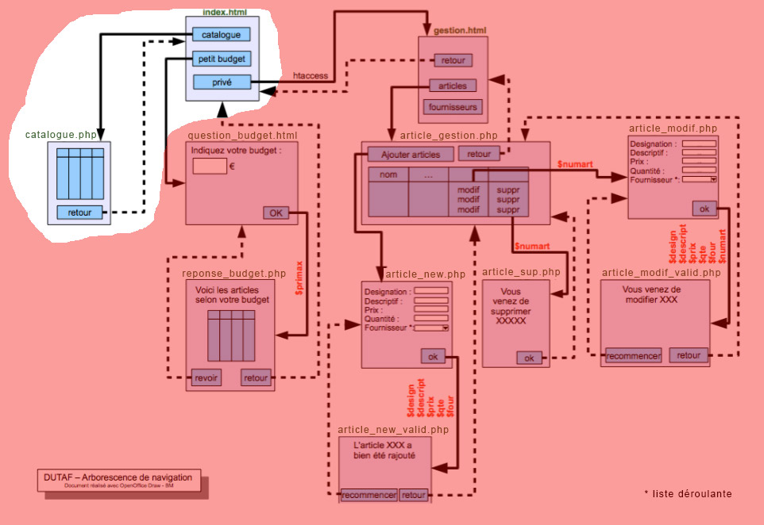

# M2203 \| Séance 7 \| Listing

## Développement de la page d'accueil

Après avoir pris connaissance de l'arbre de navigation, développez la page d'accueil \(index.html\)

## Développement de la page catalogue.php.

Pour la page listing.php, servez vous du [TD M2202](https://github.com/Dannebicque/dutafguide/blob/master/M2202-seance-2.md) sur l'affichage d'informations provenants d'une base de données. utilisez "dataTable" pour mettre en forme ce tableau d'article. \([https://datatables.net/](https://datatables.net/) \)

