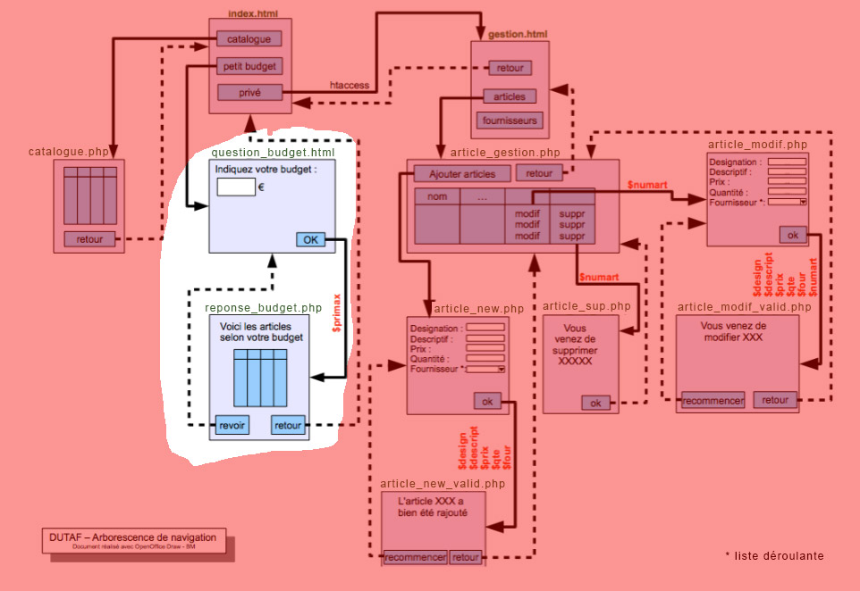

# M2203-seance-8

## M2203 \| Séance 8 \| Recherche petit prix

### 1\) développement du formulaire "petit budget" \(page form\_budget.html\)

développez la page question\_budget.html. Attention à bien nommer le champs du formulaire "prixmax" comme indiqué sur l'arbre de navigation. De plus, bien faire 'pointer' la validation du formulaire vers la page 'reponse\_budget.php' ainsi que de préciser dans les parametres du formulaire que les données seront transmises dans l'URL \(method GET\)

### 2\) développement de la page budget\_art.php.

Pour la page reponse\_budget.php, reprendre la mise en page et le php de base déjà vus dans de votre page catalogue.php

Modifier la requete SQL de cette page pour afficher uniquement les articles correspondants au budget de l'internaute \(donc en reprenant le contenu du parametre passé dans l'URL. rappel: on récupére les parametres passés dans l'url via $\_GET\['nom\_du\_parametre'\] \)

