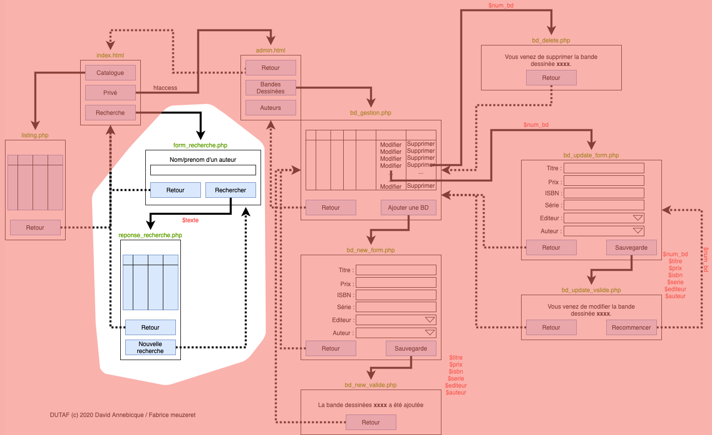

# M2203 \| Séance 8 \| Recherche par auteur

correction seance 7:

video 1 \(index.html et listing.php\): [https://youtu.be/BXjfq0-k0Y4](https://youtu.be/BXjfq0-k0Y4)

video 2  mise en forme automatique \(datatable\): [https://youtu.be/EnSk9w8fWGw](https://youtu.be/EnSk9w8fWGw)

## Développement du formulaire "petit budget" \(page form\_recherche.php\)

Développez la page `form_recherche.php`. Attention à bien nommer le champs du formulaire `texte` comme indiqué sur l'arbre de navigation. De plus, bien faire pointer la validation du formulaire vers la page `reponse_recherche.php` ainsi que de préciser dans les paramètres du formulaire que les données seront transmises dans l'URL \(méthode **GET**\)

## Développement de la page reponse\_recherche.php.

Pour la page reponse\_recherche.php, reprendre la mise en page et le php de base déjà vus dans de votre page listing.php

Modifier la requête SQL de cette page pour afficher uniquement les articles correspondants au caractères d'un nom ou d'un prénom d'un auteur existant \(donc en reprenant le contenu du paramètre passé dans l'URL. rappel: on récupère les paramètres passés dans l'url via `$_GET['nom_du_parametre']` \)


On effectue ici une recherche, dite "**selon un modèle**", c'est à dire qu'on ne recherche pas de manière exacte ce qu'a saisie l'utilisateur, mais un enregistrement qui contient les caractères demandés. Par exemple :

Ma base contient les 4 noms suivants : Léon, Odette, Vivien, Etienne.

L'utilisateur saisie "ien"

Vous devez afficher : Viv**ien** et Et**ien**ne comme réponse

pour cela regardez du côté de l'expression "... LIKE '%xxx% ..." 


