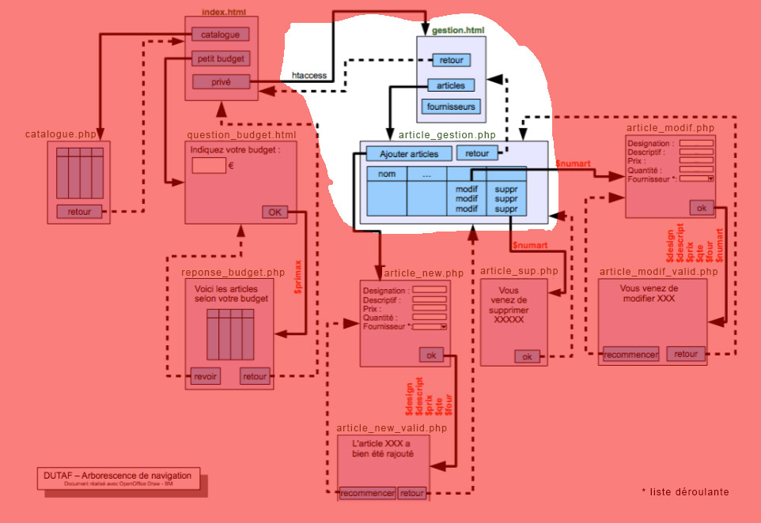

# M2203 \| Séance 9 \| Administration \(gestion.php et bd\_gestion.php\)

 

## Mettre en oeuvre la page gestion.php et la page bd\_gestion.php en les créant dans un sous-dossier "admin"

Protéger l'ensemble du dossier "admin" en ajoutant un fichier ".htaccess" et un fichier "htpasswd"

Pour crééer un fichier ".htaccess" :

Créez un nouveau fichier nommé ".htaccess", avec le point devant et sans extension, à l’aide d'un editeur de texte, et coller ce qui suit en modifiant mmiXXXX par votre identifiant mmi :

```text
AuthUserFile /home/mmiXXX/public_html/dutaf/admin/htpasswd
AuthName "Acces securise a mon site Dutaf"
AuthType Basic
<LIMIT GET POST>
Require valid-user
</LIMIT>
```

Transférer le fichier ".htaccess" dans le répertoire admin de dutaf, ainsi que le fichier "htpasswd".

Dans le fichier "htpasswd" ajouter l'empreinte :`prof:$apr1$dJfZ1bRd$kKzpw.TAK9lSU99wOIp.Q.`

pour que les enseignants puissent venir consulter le back-office.

Pour générer un mot de passe, vous pouvez utiliser ce site web \( [http://aspirine.org/htpasswd.html](http://aspirine.org/htpasswd.html) \). Une fois que vous avez chiffré le mot de passe à l’aide de l’algorithme MD5, créez un autre fichier nommé htpasswd dans lequel vous collez la ligne complète.

votre fichier htpasswd doit ressembler à ça:

```text
monlogperso:bRd$K9lSU99wOkKzr1$dJfZ
prof:$apr1$dJfZ1bRd$kKzpw.TAK9lSU99wOIp.Q.
```

faites vérifier l'accès au backoffice par votre enseignant lors de votre dernier TP.

\`\`\`

