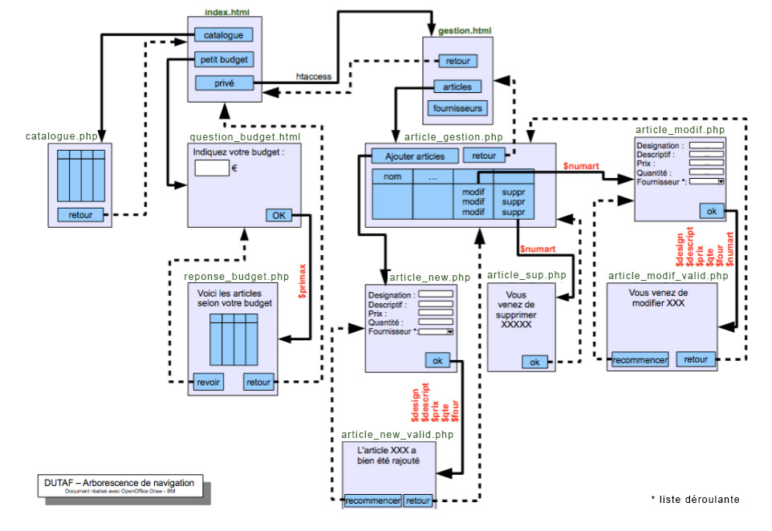

# M2203PostCm

[Retour à l'accueil](./)

## M2203 \| exo post CM \| Analyse DUTAF et Mise en place de la Bd

### Objectif :

Mettre en œuvre une Solution PHP/MySQL pour répondre à un problème de gestion de base de données.

### document :

support du cours [cm2.pdf](https://github.com/Dannebicque/dutafguide/tree/fbeb4cdebb2ab1a9902dc9e3b2f9761508d8dcd0/cm2.pdf).



### analyse SGBDR \(correction du MLD de l'analyse merise faites en CM\)

MLD:

articles\(**art\_id**, art\_design, art\_descript, art\_prix, art\_qte, \_four\_id \)

fournisseurs\(**four\_id**, four\_nom, four\_ville, four\_tel \)

### exercice 1 : mise en œuvre de la base de données sous mySQL

1. En vous basant sur le MLD , créez les 2 tables dans PhpMyAdmin.
2. Récupérez le fichier [dutaf.xls](https://github.com/Dannebicque/dutafguide/tree/fbeb4cdebb2ab1a9902dc9e3b2f9761508d8dcd0/dutaf.xls) contenant les données nécessaires au TD pour les importer dans les

   tables. \(attention, n'utilisez pas l'importation automatique ! Passez par des fichiers CSV: 1 fichier CSV par table, donc 2 fichiers CSV "fournisseurs.csv" et "articles.csv" \)

### exercice 2 : analyse fonctionnelle et mise en place du site

Analysez le cahier des charges des fonctions demandées \(visu catalogue, formulaire...\) et retrouver ces fonctionnalités dans l'arborescence proposée.

Développer l'ensemble des pages \(au moins index.html et catalogue.php\) en mode statique \(mettre quelques exemples sur la page catalogue mais aucun code php pour l'instant biensur\) 

### complément \(pour ceux qui ont du temps\):

Tester les requetes suivantes: 1. Afficher la liste des articles \(description, prix de vente\) par ordre décroissant du prix . 2. Afficher la liste des articles de moins de 50 Euros. 3. Afficher la liste complète des artcles avec à chaque fois la provenance \(le fournisseur\). 4. Supprimer l’article numéro 12. 5. Augmenter tous les prix de vente de 4%. 6. Retrouver les prix d’origine. 7. Afficher la description et le prix de l’article le moins cher. 8. Afficher la description et le prix de l'article le plus cher. 9. De la même façon, afficher le prix moyen des articles. 10. Afficher le prix moyen des articles pour chacun des fournisseurs.

