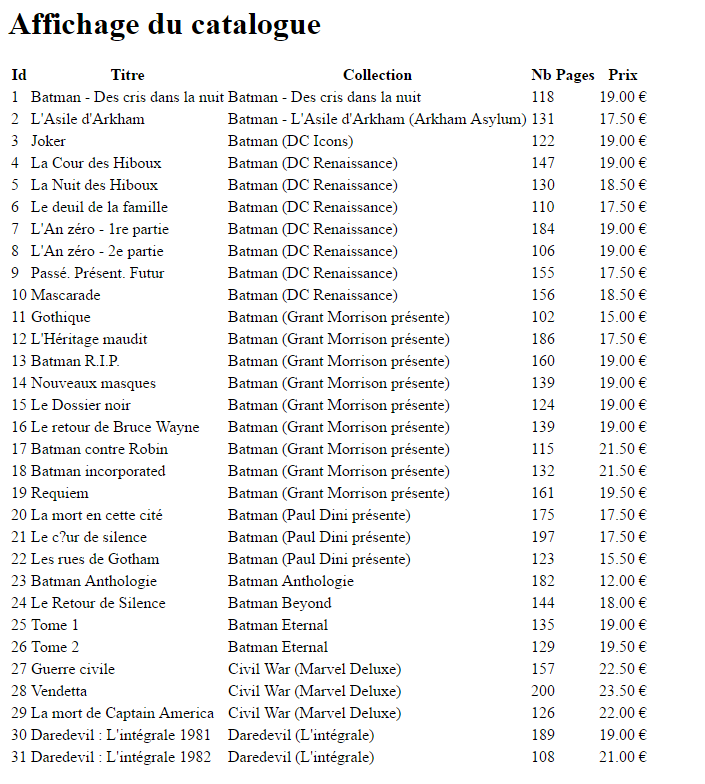

# Séance 2 : Révisions BDD

## Introduction / Rappels

Lire \(et relire\) les rappels sur la manipulation des bases de données vues en M2203 et ici [un rappel très utile](M2202-rappels-bdd.md).

### Exercice 1

1. Créer une nouvelle table dans votre base de données que vous nommerez "comics". Ajouter les champs du tableau ci-dessous.
2. Récupérer le fichier comics.csv ci-dessous
3. Vérifiez l’ordre des champs et importez les données dans votre table.
4. Préparez votre fichier config.inc.php avec vos constantes.
5. Écrire un fichier index.php qui va afficher le contenu de la table comics dans un tableau HTML.
6. Obtenir le résultat ci-dessous.

| Champs | Type | Remarque |
| :--- | :--- | :--- |
| id | integer | clé primaire |
| titre | varchar | 200 |
| collection | varchar | 200 |
| nbpages | integer |  |
| prix | double |  |



### Exercice 2

1. Ajouter le montant total de la collection en bas du tableau
2. Ajouter le prix moyen d’un album en bas du tableau.

### Exercice 3

1. Modifier votre catalogue DUTAF \(en administration\) pour afficher le prix moyen des objets en bas de page
2. Modifier votre catalogue DUTAF \(en administration\) pour afficher le prix total du stock \(le prix de chaque objet en tenant compte de la quantité disponible\)

